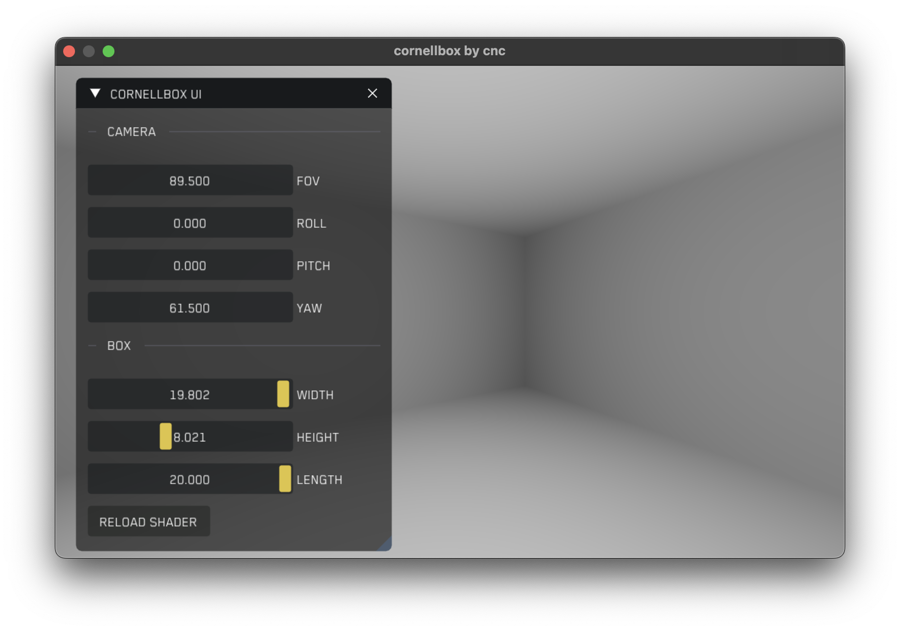

## Cornellbox inspired by Robert Hodgin
This project rebuilds the base of an art project originally created by Robert Hodgin https://roberthodgin.com

Just search on YouTube for **Robert Hodgin Eyeo2012** to watch a full video showcasing his creation. The source code is available on GitHub https://github.com/flight404/Eyeo2012

## Topics covered in this project
- creating a window
- integrating a user interface framework (ImGui)
- hardware accelerated rendering with Metal
- fake ambient occlusion shadows
- matrix transformations (scale, move, rotate)
- perspective projection
- resizeable window
- camera concept including rotation and movement

## What you need

All you need to follow along or just build this project is:

- Visual Studio Code
- XCode command line tools (not XCode itself)
- [cloc to measure lines of code](https://formulae.brew.sh/formula/cloc)

## VS Code extensions   

The following VS Code extensions are also partly necessary:

- [C/C++ Extension Pack](https://marketplace.visualstudio.com/items?itemName=ms-vscode.cpptools-extension-pack)
- [C/C++ Clang Command Adapter](https://marketplace.visualstudio.com/items?itemName=mitaki28.vscode-clang)
- [Metal Shader Extension for Visual Studio Code](https://marketplace.visualstudio.com/items?itemName=doublebuffer.metal-shader)

## How to build and run

In order to build the project clone this repository and update the submodule *libs/imgui* with<br>
```git submodule update --init```<br>

Then run ```sh build.sh ALL``` once to get ImGui to build into an object file. Every subsequent build only requires<br>
```sh build.sh``` <br>

In order to run execute <br>
```./cornellbox```

## Further links

Paper explaining quarternions:
https://danceswithcode.net/engineeringnotes/quaternions/quaternions.html

An excellent explanation about how to construct a prespective projection matrix can be found here:<br>
https://www.youtube.com/watch?v=EqNcqBdrNyI

Immediate mode user interface:<br>
https://github.com/ocornut/imgui

## Font used

The font I used to replace the standard ImGui font is **Blender Pro Book**<br>
Fonts made from <a href="http://www.onlinewebfonts.com">Web Fonts</a> is licensed by CC BY 4.0